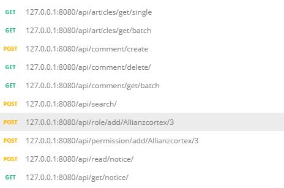

# LaraForum [](https://travis-ci.com/Allianzcortex/LaraForum)


`LaraForum` is a full-stack forum with Spring Boot as skeleton and Spring Data JPA as ORM to provide restful api in controller.

If you just want to a MVP(Minimal Valuable Product) to learn Spring , I will recommend you to my [class-project](https://github.com/Allianzcortex/code_collection/tree/master/Spring-Boot-Based-Database-TeamProject) which is simplier and implemented all CRUD functions(and pure HTML && CSS as frontend).

---

This application includes :

- `user registration/login/Change Account Info/logout` function

- Users can `add/delete  posts/comments`,the action above will trigger `notifications` that can be read

- `topic creation/deletion`

- article classification by `tag`

- page search  based on `MySQL Full-text Search` or `Fuzzy matching` keyword with `Lucene`.

---

Some APIs will be like:

- get single article by slug

```
get /api/articles/get/single/{slug}

return:
{
    'id':{id},
    'name':{name},
    'tag':[1,2,3]
}
```

- get batch articles by multiple conditions ：
```
get /api/articles/get/batch?tag=xx&author=yy
```

- push notifications to certain user
```
post /api/read/notice/{userId}
```

- add permissions for user
```
/api/permission/add/{user}/2
```

- set roles for user

```
/api/role/add/{user}/2
```

- search by keyword
```
/api/search/{keyWord}
```
... etc

---

Except using `@ControllerAdvice` to handle global exception and `@ResponseEntity` to return the header and data both.There are also some other features:


1. LightWeight:

Lightweight here refers to components other than `Springboot+Spring JPA+Spring MVC` are not involved. Two more important features :`authentication` and
`Authorization` are implemented based on Spring framework without rely on third-party packages(e.g. `spring-security` or `shrio`) 

① `authentication` is achieved by `JWT(Json Web Token)`. You can check the [verification-code by filter]( https://github.com/Allianzcortex/LaraForum/blob/master/src/main/java/com/laraforum/authentication/GetJwtTokenFilter.java) and           [judgement-code by interceptor](https://github.com/Allianzcortex/LaraForum/blob/master/src/main/java/com/laraforum/authentication/ParseJwtTokenInterceptor.java). Results calculated will be read by backend application after `request.setAttribute` to avoid duplicate verification.
<!-- 关于 jwt 实现过期 logout 在纯后端应用里相对难实现(前端直接删除 jwtToken 即可，现在采用的方法是存储到数据库里，不符合 stateless 无状态思想，因为原话是会 requires a DB lookup each time)。比较理想
的做法是在 SO 上看到的这个 [评论](https://stackoverflow.com/questions/21978658/invalidating-json-web-tokens#comment45057142_23089839)，在写入 Token 的值里进行操作，后续会实现这一点。 -->

② `authorization` is achieved by `@annotation`+`AspectJ` to do the `AOP(aspect-oriented programming)`. Two annotations are `@RequirePermissiona`([code](https://github.com/Allianzcortex/LaraForum/blob/master/src/main/java/com/laraforum/authorization/RequirePermissions.java)) and `@RequireRoles`([code](https://github.com/Allianzcortex/LaraForum/blob/master/src/main/java/com/laraforum/authorization/RequireRoles.java)) managed by `RolesAndPermissionsChecker`([code](https://github.com/Allianzcortex/LaraForum/blob/master/src/main/java/com/laraforum/authorization/RolesAndPermissionsChecker.java)).If you need to add permission manage for your logical code , you only need to add the permissions like 
`@RequirePermission("youPermission")` without intrusion to original code(Python-decorator like,e.g. in [code](https://github.com/Allianzcortex/LaraForum/blob/104b16fcd8847aa84bb9f5947d57f8c848fb3e5a/src/main/java/com/laraforum/controller/OtherController.java#L86) ,only people with `create_post` permission are allowed to publish the post )

```
@RequirePermissions("create_post")
@Transactional
@PostMapping("permission/add/{userName}/{pNumber}")
public void addUserPermission(@PathVariable String userName, @PathVariable Integer pNumber) {
   // logic
}

```

---

2. `UnitTest` And `IntegrationTest`

- `Integration Test` is essential because spring application needs to interact with real world.

- `Unit Test` is also important when testing the correctness of single function(e.g. [article-slug-test-code](https://github.com/Allianzcortex/LaraForum/blob/master/src/test/java/com/laraforum/utils/ArticleUtilsTest.java#L12))

Main frameworks are `Junit` 与 `Mockito` IntegrationTest is on `Repository` layer to judge whether the data can really be inserted to database([code](https://github.com/Allianzcortex/LaraForum/blob/master/src/test/java/com/laraforum/repository/UserRepositoryTest.java)).UnitTest is on `Service` layer to judge whethere the controller will invoke corresponding  Repository([code](https://github.com/Allianzcortex/LaraForum/blob/master/src/test/java/com/laraforum/service/UserServiceMockitoTest.java)).

```
@Test
public void whenUserSave_thenCheckSuccess(){
     userServiceMock.save(user);
     verify(userRepositoryMock).save(user);
}
```

This [code](https://github.com/Allianzcortex/LaraForum/blob/master/src/test/java/com/laraforum/controller/UserControllerMockitoTest.java) will test service reaction.

<!-- 暂时测试了 `User/UserRepositor/UserService/UserController` ，后续会进一步补充。 -->

- Test Results:


FrontEnd is developed by `Angular` , and more pages are in the progress, you can check the [Lara/FE](LaraFE/) for more details.

Below is the postman screenshots.




---

#### Project Structure 

```
├── main
│   ├── java
│   │   └── com
│   │       └── laraforum
│   │           ├── authentication
│   │           │   ├── GetJwtTokenFilter.java
│   │           │   ├── JwtProvider.java
│   │           │   ├── ParseJwtTokenFilter.java
│   │           │   └── ParseJwtTokenInterceptor.java
│   │           ├── authorization
│   │           │   ├── RequirePermissions.java
│   │           │   ├── RequireRoles.java
│   │           │   └── RolesAndPermissionsChecker.java
│   │           ├── configuration
│   │           │   ├── FilterConfigure.java
│   │           │   ├── InterceptorConfigure.java
│   │           │   ├── MySqlRepositoryConfigure.java
│   │           │   ├── RepositoryConfig.java
│   │           │   └── SearchConfiguration.java
│   │           ├── controller
│   │           │   ├── ArticleController.java
│   │           │   ├── CommentController.java
│   │           │   ├── OtherController.java
│   │           │   └── UserContoller.java
│   │           ├── exception
│   │           │   ├── CustomException.java
│   │           │   ├── Handle
│   │           │   │   └── ResponseEntityException.java
│   │           │   └── UnAuthorizedException.java
│   │           ├── LaraApplication.java
│   │           ├── model
│   │           │   ├── ArticleComment.java
│   │           │   ├── Article.java
│   │           │   ├── Comment.java
│   │           │   ├── dto
│   │           │   │   ├── ArticleView.java
│   │           │   │   ├── ArticleWhenCreated.java
│   │           │   │   └── UserWithEmailAndPassWord.java
│   │           │   ├── enums
│   │           │   │   ├── Permission.java
│   │           │   │   └── Role.java
│   │           │   ├── Favorite.java
│   │           │   ├── Notification.java
│   │           │   ├── Tag.java
│   │           │   ├── Token.java
│   │           │   └── User.java
│   │           ├── repository
│   │           │   ├── ArticleCommentRepository.java
│   │           │   ├── ArticleRepository.java
│   │           │   ├── CommentRepository.java
│   │           │   ├── FavoriteRepository.java
│   │           │   ├── NotificationRepository.java
│   │           │   ├── PermissionRepository.java
│   │           │   ├── RoleRepository.java
│   │           │   ├── TagRepocitory.java
│   │           │   ├── TokenRepository.java
│   │           │   └── UserRepository.java
│   │           ├── service
│   │           │   ├── ArticleCommentService.java
│   │           │   ├── ArticleService.java
│   │           │   ├── CommentService.java
│   │           │   ├── FavoriteService.java
│   │           │   ├── impl
│   │           │   │   ├── ArticleCommentServiceImpl.java
│   │           │   │   ├── ArticleServiceImpl.java
│   │           │   │   ├── CommentServiceImpl.java
│   │           │   │   ├── FavoriteServiceImpl.java
│   │           │   │   ├── NotificationServiceImpl.java
│   │           │   │   ├── PermissionServiceImpl.java
│   │           │   │   ├── RoleServiceImpl.java
│   │           │   │   ├── SearchServiceImpl.java
│   │           │   │   ├── TokenServiceImpl.java
│   │           │   │   └── UserServiceImpl.java
│   │           │   ├── NotificationService.java
│   │           │   ├── PermissionService.java
│   │           │   ├── RoleService.java
│   │           │   ├── SearchService.java
│   │           │   ├── TokenService.java
│   │           │   └── UserService.java
│   │           └── util
│   │               ├── ArticleUtils.java
│   │               └── TestUtils.java
│   └── resources
│       ├── application.properties
│       ├── db-schema.sql
│       └── static
│           └── images
│               └── register.png
└── test
    └── java
        └── com
            └── laraforum
                ├── authentication
                │   └── JwtTokenTest.java
                ├── configuration
                │   └── ServiceTestConfiguration.java
                ├── controller
                │   └── UserControllerMockitoTest.java
                ├── LaraApplicationTests.java
                ├── repository
                │   └── UserRepositoryTest.java
                ├── service
                │   └── UserServiceMockitoTest.java
                ├── UserEntityTest.java
                └── utils
                    └── ArticleUtilsTest.java
```


