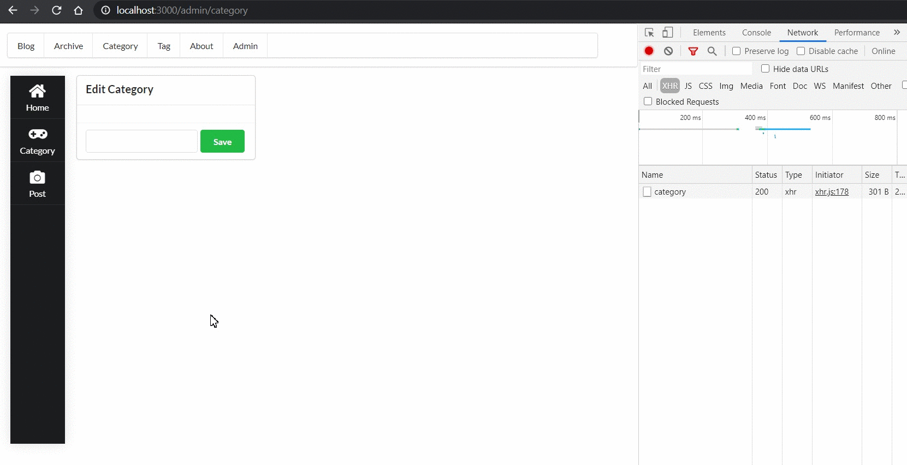

This project was bootstrapped with [Create React App](https://github.com/facebook/create-react-app).

## Available Scripts

run `yarn start` to run the app after all dependencies are installed.

Open [http://localhost:3000](http://localhost:3000) to view it in the browser.

---

Tech stack includes `React + Redux + React-Router + Typescript + axios + Semantic-UI`

A simple demo :

Backend is powered by **Spring Boot**

